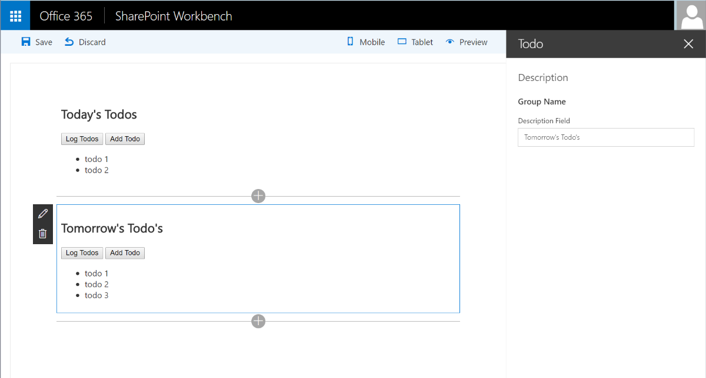

#  Angular2 Web Part Prototype

## Note to developers
> This web part sample is currently in prototype phase and subject to change.
This sample is not currently supported for use in production enviornments as unexpected behavior may occur.
It is provided as guidance for building Angular2 web parts in the SharePoint Framework environment.
This sample is a work in progress and it will be updated as advances in stability are made.

## Summary
Sample To Do Web Part built with Angular2. This sample illustrates how you can use Angular2 with the SharePoint Framework.

## Applies to

* [SharePoint Framework Developer Preview](http://dev.office.com/sharepoint/docs/spfx/sharepoint-framework-overview)
* [Office 365 developer tenant](http://dev.office.com/sharepoint/docs/spfx/set-up-your-developer-tenant)

## Prerequisites

> Some familiarity of Angular2 architecture.

## Solution

Solution|Author(s)
--------|---------
angular2-prototype | Manish Garg, Daniel Gaeta

## Version history

Version|Date|Comments
-------|----|--------
0.2|October 7, 2016|Resolved workarounds to access NgModule and NgZone
0.1|August 14, 2016|Initial release

## Disclaimer
**THIS CODE IS PROVIDED *AS IS* WITHOUT WARRANTY OF ANY KIND, EITHER EXPRESS OR IMPLIED, INCLUDING ANY IMPLIED WARRANTIES OF FITNESS FOR A PARTICULAR PURPOSE, MERCHANTABILITY, OR NON-INFRINGEMENT.**

---

## Minimal Path to Awesome

- Clone this repository
- In the command line run:
  - `npm i`
  - `npm i -g gulp`
  - `tsd install`
  - `gulp serve`
- Open the workbench
- Test out the web part

## Features
The todo web part is a sample client-side web part built on the SharePoint Framework. The web part makes use of the Angular2 framework pattern.
The todo web part has a built in `BaseAnagular2WebPart` class to abstract away the React and Flux pattern of the SharePoint Framework.
This allows you to design your web part very closely to how you would design a standalone Angular2 project.

### Protoype anomalies
Angular2 uses decorators to attach metadata to classes so that Angular will know how to process the class.
When bootstrapping the same Angular2 module class more than once, the system will add more metadata objects to the same class.
However, when Angular2 encounters this class it will only use the first metadata object to process the class.
This results, in only the first processed Angular2 module class to work as expected on the page.
To work around this, we define the Angular2 module class using a vanilla javacript class definition wrapped in a closure.
This causes each Angular2 module to be created at run time and each appear as a unique class, now Angular2 will process each class with it's own metadata unique object.
You can view this class defition in `BaseAnagular2WebPart.ts`.

### Adding functionality
To add functionality to this web part prototype the main file to edit is `TodoWebPart.ts`, here there are comments to help you alter the prototype.

### Web part concepts
The web part displays a title, button to add to dos and a button to print the to do items to the console.
This web part illustrates the following concepts on top of the SharePoint Framework:

- changing a property (the title) of a web part using the property pane
- manipulating properties in the Angular2 component class and saving to SharePoint's property bag
- creating multiple Angular2 applications on the same page of the same NgModule class

